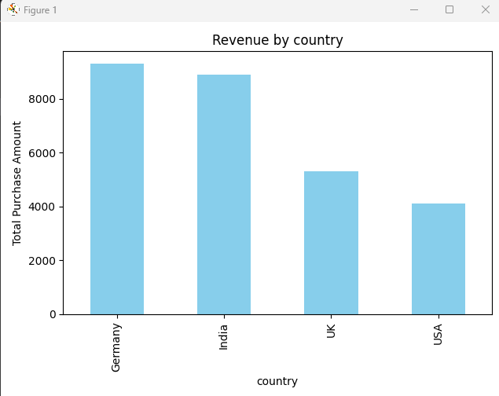
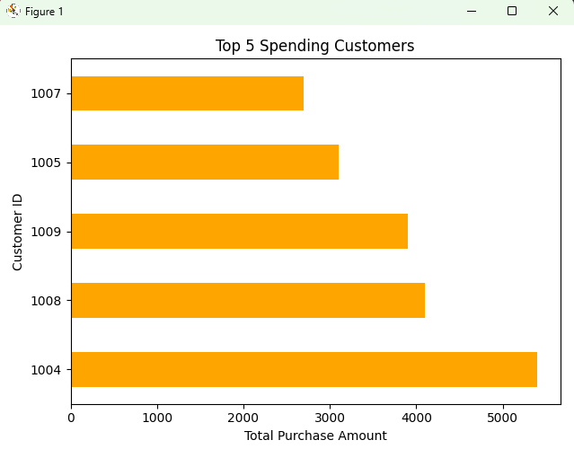
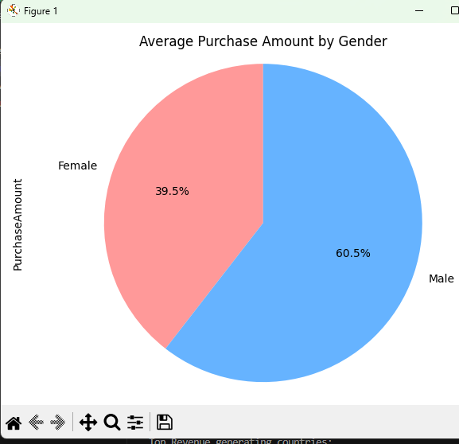

markdown
# 🛍️ E-commerce Customer Analysis

This is a data analysis project built with Python, Pandas, and Matplotlib to explore customer purchase behavior in an e-commerce dataset.

---

## 📊 Key Features
- Revenue by country (bar chart)
- Top 5 spending customers (horizontal bar)
- Average purchase amount by gender (pie chart)
- Clean code and visual insights using Matplotlib

---

## 🛠️ Tech Stack
- Python
- Pandas
- Matplotlib
- VS Code

---

## 🚀 How to Run

To run this project on your local machine:

### 1. Clone the Repository
```bash
git clone https://github.com/HamsaHansa1102/data-analysis-projects.git 
```

2. Navigate to the Project Folder
```bash
cd data-analysis-projects/ecommerce-customer-analysis
```

3. (Optional) Create and Activate a Virtual Environment
```bash
python -m venv venv
source venv/bin/activate  # Windows: venv\Scripts\activate
```

4. Install Dependencies
```bash
pip install -r requirements.txt
```

5. Run the Project
```bash
python main.py
```

---

## 📸 Screenshots

### Revenue by Country


### Top Spending Customers


### Purchase Distribution by Gender
